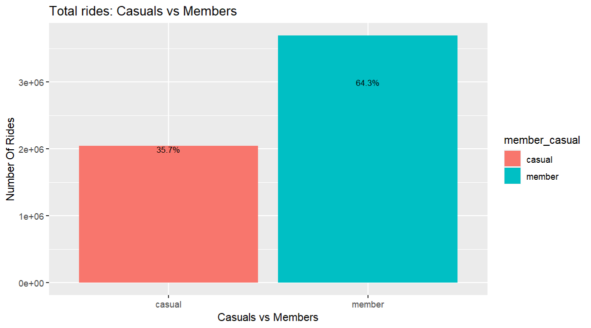
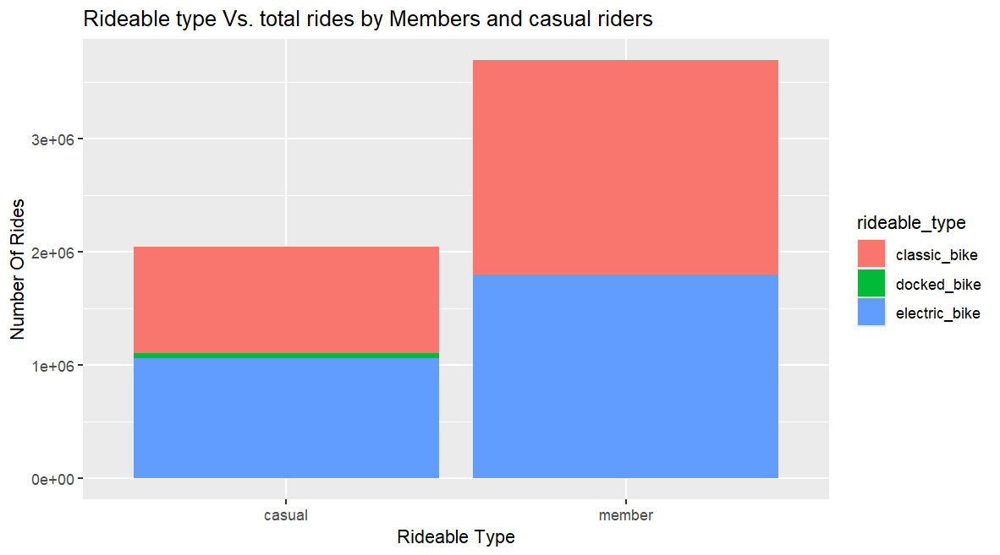
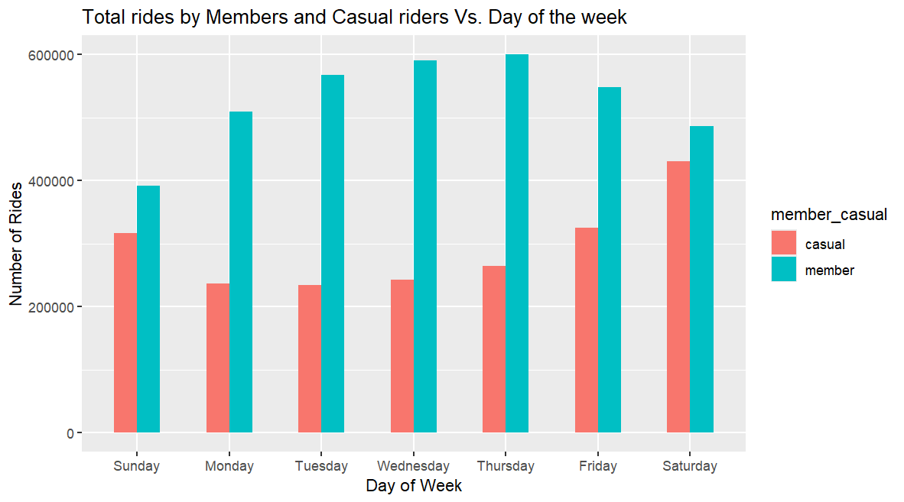
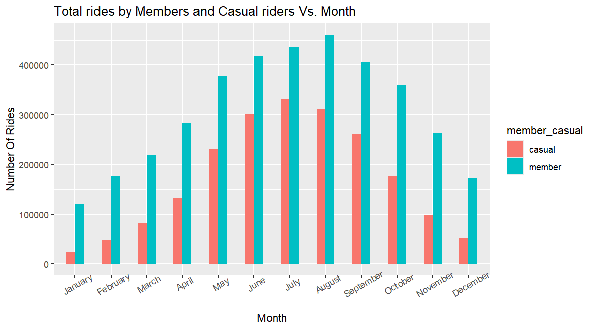
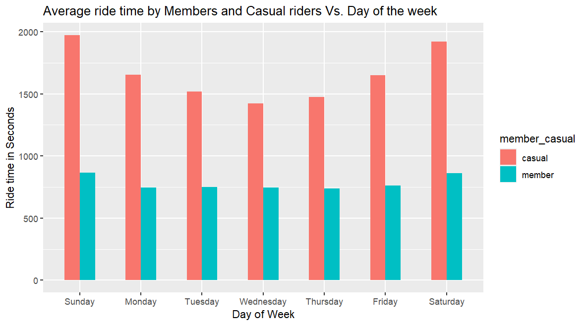
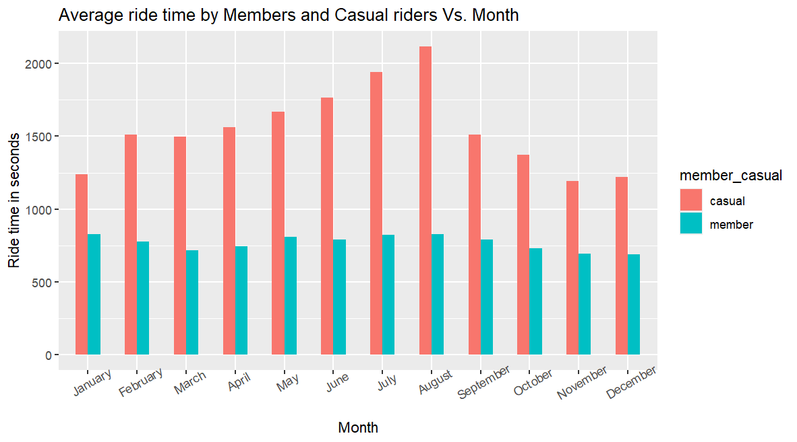
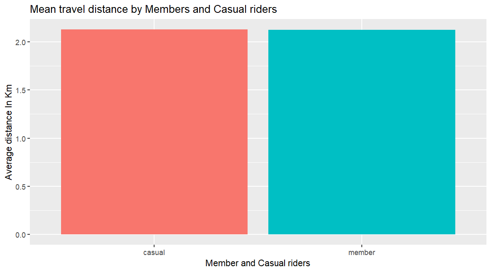
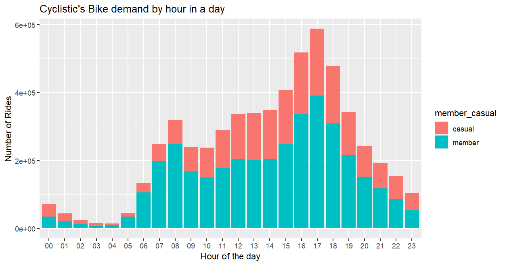
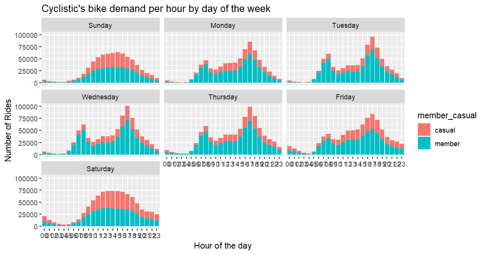

# Cyclistic bike-share analysis case study

## Introduction

Welcome to my capstone project for the Google Data Analytics Certificate course.

You are a junior data analyst working on the marketing analyst team at Cyclistic, a bike-share company in Chicago. The director of marketing believes the company’s future success depends on maximizing the number of annual memberships. Therefore, your team wants to understand how casual riders and annual members use Cyclistic bikes differently. From these insights, your team will design a new marketing strategy to convert casual riders into annual members. But first, Cyclistic executives must approve your recommendations, so they must be backed up with compelling data insights and professional data visualizations.

The project follows the six step data analysis process: ask, prepare, process, analyze, share, and act.

## PHASE 1: Ask

The goal of this case study is to identify how do annual members and casual riders use Cyclistic bikes differently. To address this business task, the following questions will guide the analysis:

*Percentage of Annual Members vs Casual Riders
*Number of Rides by Bike Type
*Number of Rides per Day and per Month
*Average Ride Time (in seconds) by day and month
*Average Ride Distance
*Frequency of Rides per Hour

Primary stakeholders: The director of marketing and Cyclistic executive team
Secondary stakeholders: Cyclistic marketing analytics team

## PHASE 2: Prepare

The data used for this project is a public data and has been made available by Motivate International Inc. I will be using historical trip data from the last 12 months (June 2023 - May 2024).The dataset consists of 12 CSV files (each for a month) with 13 columns and more than 4 million rows.

## PHASE 3: Process

Before we start analyzing, it is necessary to make sure data is clean, free of error and in the right format. 

1. I will be using R programming language and RStudio IDE for statistical analysis and visualization of data because of its ability to handle huge datasets efficiently. 
```r
### install and load necessary packages
library(tidyverse)
library(ggplot2)
library(dyplyr)
library(geosphere)

2. Import individual monthly datasets and create data frames for each file. Check the column names and data structures for consistency across all files. Combine all data into one big data frame.
```r
tripdata <- bind_rows(june23, july23, aug23, sept23, oct23, nov23,
                      dec23, jan24, feb24, mar24, apr24, may24)

3. Inspect new data frame that has been created. The following actions were performed after inspection:

*Converted 'started_at' and 'ended_at' columns to POSIXct format
*Added 'ride_length' column and calculated the length of each ride
*Added new columns of data - date, month, year, day of week
```r
tripdata <- tripdata %>%
  mutate(year = format(as.Date(started_at), "%Y")) %>% 
  mutate(month = format(as.Date(started_at), "%B")) %>% 
  mutate(date = format(as.Date(started_at), "%d")) %>%
  mutate(day_of_week = format(as.Date(started_at), "%A")) %>%
  mutate(ride_length = difftime(ended_at, started_at)) %>%
  mutate(start_time = strftime(started_at, "%H"))
*Converted ride length from factor to numeric
*Added ride distance in km
```r
tripdata$ride_distance <- distGeo(matrix(c(tripdata$start_lng, tripdata$start_lat), ncol = 2), 
                                  matrix(c(tripdata$end_lng, tripdata$end_lat), ncol = 2))
tripdata$ride_distance <- tripdata$ride_distance/1000 #distance in km
*The data frame includes a few hundred entries when bikes were taken out of docks and checked for quality where ride_length was negative or 'zero'. These rides were deleted and new version of data frame is created
```r
tripdata_clean <- tripdata[!(tripdata$start_station_name == "HQ QR"|tripdata$ride_length <= 0),]

## PHASE 4: Data Analysis and Visualization

Click [here](https://github.com/vaishnavipaithane/Cyclistic-bike-share-analysis-case-study/blob/main/Scripts/Cyclistic%20bike-share%20analysis%20script.R) to view the R script and the summary of the complete analysis process.

## PHASE 5: Share

The share phase presents the insights and findings derived from the analysis of Cyclistic Bike Share data. The analysis revealed several key findings:

1. Percentage of  Casual Riders vs Annual Members 

According to the Casuals vs Members distribution chart, members accounted for the majority of the rides, representing 64.3%, while casual riders made up 35.7% of the dataset. Thus, members' ride share is approximately 30% higher than that of casual riders.



2. Number of Rides by Bike Type

The analysis of bike types reveals that members mostly use classic bikes, followed by electric bikes. However, casual riders showed a preference for docked bikes, along with other types of bikes.



3. Number of Rides per Day

The number of rides taken by members is consistently high throughout the week compared to casual riders. However, there is an increase in the number of rides taken by casual riders on the weekend.



4. Number of Rides per Month

Analysis reveals that the number of rides taken by members is consistently high throughout the year compared to casual riders. The months of June, July, August, and September account for the highest number of rides for both members and casual riders, indicating a busy time of the year. However, there is a drop in rides during December, January, and February due to the winter season.



5. Average Ride Time by Day (in seconds)

Casual riders have a higher average ride time compared to members, especially on weekends.



6. Average Ride Time by Month (in seconds)

The average ride time of members is consistently less than 1000 seconds throughout the year. Meanwhile, the average ride time of casual riders is significantly higher, exceeding 1500 seconds, especially in the months of May, June, July, and August



7. Average Ride Distance

From the chart below, we can see that both types of riders travel about the same average distance. This similarity could be due to members taking rides with consistent ride times throughout the week, while casual riders take rides mostly on weekends with higher ride times.



8. Frequency of Ride per hour in a day

The chart shows distinct variations in the frequency of rides per hour for both members and casual riders. Both groups experience peak usage at 1700 hours (5 PM), with the highest number of rides occurring during that hour.



9. Frequency of Ride per hour by day of the week

On weekdays, there is a notable increase in rides during the morning (7 am to 9 am) and another peak in the evening (4 pm to 6 pm). This pattern indicates that members use bikes for daily commuting to and from work, displaying consistent behavior throughout the weekdays. In contrast, weekends show a marked difference between members and casual riders. Casual riders demonstrate a substantial increase in bike usage on Saturdays and Sundays, indicating a preference for other activities.



## PHASE 6: Act

### Key takeaways

*Annual members hold the largest proportion of total rides, approximately 30% more than casual riders. They take more rides throughout the year with shorter ride times, and their ride frequency peaks during weekdays, most likely due to commuting for work, and declines slightly over weekends.
*Casual riders have longer ride durations compared to members and are most active on weekends, likely using bikes for leisure activities.
*Both riders peak during summer season (June, July, and August) and decline during winter season (Dec, Jan, and Feb).

### Recommendations

*Provide special discounts to casual riders when they opt for an annual membership, emphasizing the advantages and cost-effectiveness of long-term commitment.
*Provide discounts on family plans when converting to annual membership.
*Provide referral discounts to both annual members and casual riders for recruiting friends or family.
*Establish partnerships with high schools and universities to provide incentives for students.
*Promote the ease of use, affordability, accessibility, eco-friendly options, and common uses of bike rides.


